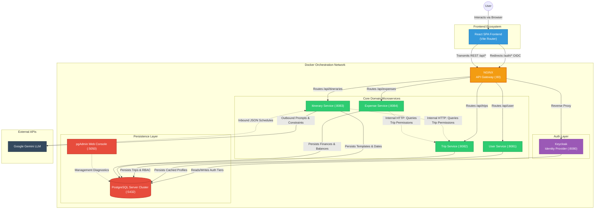

# TripTribe Application Architecture

Below is the holistic architecture diagram for the microservices-based version of TripTribe. This diagram visualizes the flow of data from the end-user's browser, through the infrastructure API Gateway, into the isolated backend Spring Boot services, and finally down to the persistent database layers. 

## Architectural Highlights
1. **The Infrastructure Perimeter:** External users never hit the Java microservices directly. All external payloads must pass through the `NGINX API Gateway`, which acts as a traffic router.
2. **Stateless JWTs:** `Keycloak` handles generating OAuth tokens. Once the React client has the token, it attaches it to every subsequent `/api/*` call. The individual Java microservices (`User`, `Trip`, `Itinerary`, `Expense`) do not connect back to Keycloak line-by-line; they cryptographically verify the token signatures locally for massive speed enhancements.
3. **Internal Container Networking:** The `Itinerary` and `Expense` services feature dotted logical lines connecting to the `Trip Service`. Without exposing their vulnerabilities to NGINX, they securely ping the Trip Service internally on the Docker network to resolve permission hierarchies (e.g., verifying if a user is an `OWNER` before letting them delete an expense).
4. **Segregated Persistence:** While practically sharing the same Postgres server instance locally to save RAM, the logic operates natively as if each microservice commands its own distinct database schema.
